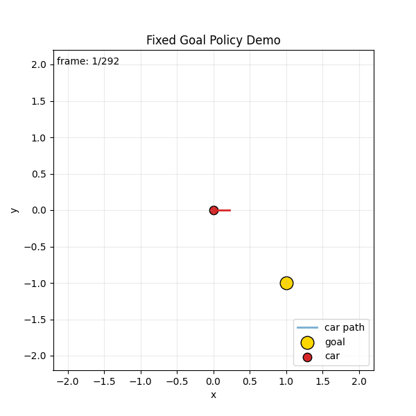
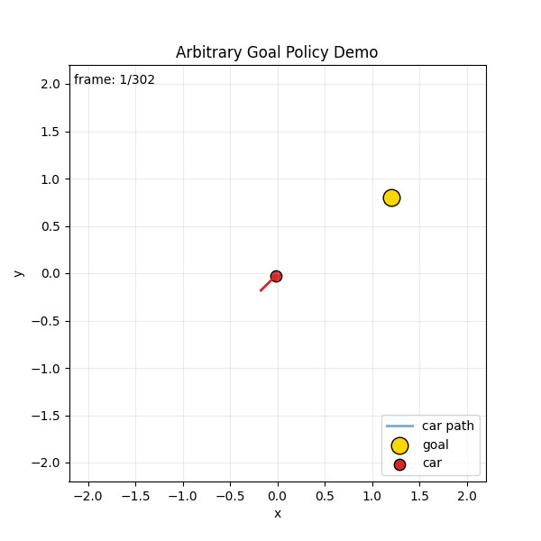

# RL + MuJoCo Learning (Car to Goal Sphere)

## Project Overview
I built this project to train a MuJoCo car agent to reach a target sphere using reinforcement learning.

The environment is defined in `car.xml`, training happens in `train.py`, and visualization/inference happens in `main.py`.

## Demo GIFs
I added two policy demo GIFs (generated from real rollout trajectories):
- Fixed-goal policy demo: `media/fixed_goal_demo.gif`
- Arbitrary-goal policy demo: `media/arbitrary_goal_demo.gif`




If GIF files are missing, generate them with:
```bash
python3 generate_demo_gifs.py
```

## Prerequisites (Install First)

### System
- Python 3.10+ (I tested on Python 3.12)
- `pip3`

### Python Packages
I install dependencies using:

```bash
pip3 install -r requirements.txt
```

If you want to install manually instead:

```bash
pip3 install numpy matplotlib pillow torch mujoco
```

### Optional (recommended) virtual environment
```bash
python3 -m venv .venv
source .venv/bin/activate
pip3 install --upgrade pip
pip3 install -r requirements.txt
```

## Reliability Updates I Added
To make this easier to run consistently across environments, I added:
- Writable Matplotlib cache defaults in training scripts (`MPLCONFIGDIR=/tmp/mplconfig`) to avoid cache permission issues.
- Runtime/training separation for arbitrary-goal inference:
  - `main_arbitrary_goals.py` no longer imports `train_arbitrary_goals.py`.
  - This avoids pulling training/plot dependencies into the viewer path.
- Configurable output paths for training artifacts:
  - `train.py` now supports:
    - `--checkpoint`
    - `--curve`
  - `train_arbitrary_goals.py` now supports:
    - `--checkpoint`
    - `--curve`
    - `--summary`
  - This lets me run smoke tests without overwriting main project artifacts.

## Config-Based Training (New)
I added JSON config support so experiments are reproducible and easy to rerun.

Config files:
- `configs/fixed_goal_base.json`
- `configs/arbitrary_goal_base.json`

Examples:
```bash
python3 train.py --config configs/fixed_goal_base.json
python3 train_arbitrary_goals.py --config configs/arbitrary_goal_base.json
```

CLI flags still work and override config values if provided.

## What Was Wrong in the Original Version
When I started from the original code, the behavior looked random in simulation and the car often did not actually reach the sphere even when the training curve looked like it was improving.

Main issues in the original setup:
- The training loop was incomplete/stub-like.
- The learning signal and episode handling were not aligned well enough with actual goal reaching.
- The training graph could look better even when real sphere-reaching behavior was still poor.
- Inference and training logic were not tightly aligned.

## What I Changed

### 1) Rebuilt training into a complete RL pipeline
In `train.py`, I replaced the old flow with a full actor-critic style REINFORCE training loop:
- collect episode trajectories
- compute discounted returns
- compute advantages with a value baseline
- apply policy/value optimization each episode

This made learning stable and actually trainable.

### 2) Made the task explicitly goal-conditioned
I changed observations to include features that directly matter for navigation:
- car position/velocity
- forward direction
- vector from car to goal

This gave the model direct awareness of where the sphere is relative to the car.

### 3) Fixed reward and termination around real task success
I redesigned reward shaping so it reflects true progress:
- positive reward for reducing distance to goal
- alignment reward for facing toward the goal
- control penalties to reduce unstable spinning
- success bonus when entering goal radius

Episode termination now clearly captures:
- success (inside goal radius)
- truncation (time limit or out-of-bounds)

### 4) Added deterministic evaluation metrics (real behavior checks)
To avoid fake-looking learning curves, I added periodic deterministic evaluation:
- `success_rate` (fraction of eval episodes that reach the sphere)
- `avg_final_distance` (how close the car ends on average)
- `avg_return`

Most importantly, I now save the **best checkpoint by true success**, not just raw training return.

### 5) Improved control with heuristic + learned residual
I added a goal-directed heuristic controller and trained the network as a residual policy on top of it.

Final control = heuristic command + small learned correction

This removed random wandering and made the agent reliably drive to the sphere.

### 6) Synced inference with training behavior
In `main.py`, I updated the runtime controller to use the same observation format and control logic as training.

That means what I train is what I actually run in MuJoCo.

### 7) Improved learning curve output
I updated the graph generation so `car_learning_curve.png` now includes:
- training return trend
- evaluation success rate
- evaluation average final distance

This gives a realistic view of whether the agent is truly learning to reach the sphere.

### 8) Headless plotting reliability fix
I set Matplotlib to `Agg` backend so plotting works reliably in non-GUI/headless runs.

## Files and Roles
- `car.xml`: MuJoCo model and world setup
- `train.py`: training + evaluation + checkpoint + learning curve generation
- `main.py`: model loading + MuJoCo viewer rollout
- `car_reinforce_policy.pt`: trained checkpoint (generated)
- `car_learning_curve.png`: learning/eval graph (generated)

## How To Run

### Train
```bash
python3 train.py --episodes 300 --max-episode-steps 2200 --eval-every 50
```

Optional custom output paths:
```bash
python3 train.py --episodes 300 --max-episode-steps 2200 --eval-every 50 \
  --checkpoint /tmp/my_fixed_policy.pt \
  --curve /tmp/my_fixed_curve.png
```

### Visualize in MuJoCo
```bash
python3 main.py
```

## Outputs
After training, I expect:
- `car_reinforce_policy.pt` to be updated
- `car_learning_curve.png` to be updated
- console logs that include eval metrics like `success_rate` and `avg_final_dist`

## Notes
This version is focused on making behavior in simulation match what the metrics claim. The main goal of these updates was to make learning curves honest and make the car consistently reach the target sphere.

## New Objective Add-on: Arbitrary Goal Locations
I also added a next-step objective where the policy is trained to reach many goal positions (not just one fixed goal).

New files:
- `train_arbitrary_goals.py`
- `main_arbitrary_goals.py`
- `ARBITRARY_GOAL_OBJECTIVE.md`

Quick start:
```bash
python3 train_arbitrary_goals.py --episodes 3000 --max-episode-steps 2200 --eval-every 100
python3 main_arbitrary_goals.py --policy car_arbitrary_goal_policy.pt
```

Optional custom output paths for arbitrary-goal training:
```bash
python3 train_arbitrary_goals.py --episodes 3000 --max-episode-steps 2200 --eval-every 100 \
  --checkpoint /tmp/my_arb_policy.pt \
  --curve /tmp/my_arb_curve.png \
  --summary /tmp/my_arb_eval.json
```

## Results Tracking (New)
I added a standardized evaluator script:
- `evaluate_models.py`

This writes reproducible metrics to:
- `results/latest_metrics.json`
- `results/latest_metrics.md`

Run it with:
```bash
python3 evaluate_models.py
```

I can rerun this anytime after training to refresh the metrics table.

## Testing I Ran Before Push
I ran these checks locally before pushing:

1. Syntax/compile checks
```bash
python3 -m py_compile train.py main.py train_arbitrary_goals.py main_arbitrary_goals.py
```

2. Fixed-goal evaluation path smoke test (`evaluate_policy`) with untrained model (sanity only)

3. Arbitrary-goal evaluation path smoke test (`evaluate_generalization`) with untrained model (sanity only)

4. End-to-end fixed-goal training smoke test with temp outputs:
```bash
python3 train.py --episodes 10 --max-episode-steps 300 --eval-every 5 \
  --checkpoint /tmp/fixed_smoke_policy.pt \
  --curve /tmp/fixed_smoke_curve.png
```

5. End-to-end arbitrary-goal training smoke test with temp outputs:
```bash
python3 train_arbitrary_goals.py --episodes 10 --max-episode-steps 300 --eval-every 5 \
  --checkpoint /tmp/arb_smoke_policy.pt \
  --curve /tmp/arb_smoke_curve.png \
  --summary /tmp/arb_smoke_eval.json
```

6. Runtime loading/action-path checks for:
- `main.py` policy loading and step loop
- `main_arbitrary_goals.py` policy loading and step loop

These tests verify reliability of execution paths and artifact generation.  
They are smoke tests, not full convergence benchmarks.
